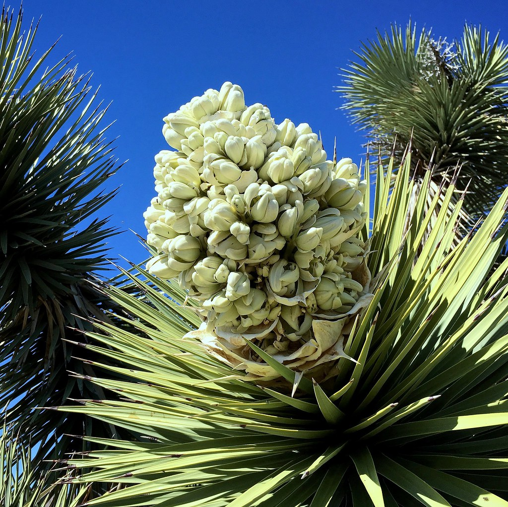

# Intro-to-the-Tidyverse
R-Ladies Meetup May 2019  
Leaders: An Bui, Sam Csik

## Getting started
If you are participating in the workshop, you may either (a) work on the [intro_to_the_tidyverse_TEMPLATE.Rmd](https://github.com/samanthacsik/Intro-to-the-Tidyverse/blob/master/intro_to_the_tidyverse_TEMPLATE.Rmd), which leaves space for participants to type code alongside the instructors, or (b) follow along in the [intro_to_the_tidyverse_KEY.Rmd](https://github.com/samanthacsik/Intro-to-the-Tidyverse/blob/master/intro_to_the_tidyverse_KEY.Rmd), which has all of the information and code we will be reviewing. Download the [intro_to_the_tidyverse_KEY.html](https://github.com/samanthacsik/Intro-to-the-Tidyverse/blob/master/intro_to_the_tidyverse_KEY.html) for a knitted (and much easier to read) version of the KEY.

## Outline
1. What is the tidyverse?
2. Useful functions to know
3. Wrangling and plotting data

## Data source
All flower phenology data is from the [USA Phenology Network](https://www.usanpn.org/usa-national-phenology-network). In this workshop, we work with species that occur on [Serrano](https://www.sanmanuel-nsn.gov/Culture/Cultural-Overview), [Cahuilla](http://www.aguacaliente.org/content/History%20and%20Culture/), [Mojave](https://www.fortmojaveindiantribe.com/), and [Chemehuevi](http://www.chemehuevi.net/history-culture/) ancestral land, or [Joshua Tree National Park](https://www.nps.gov/jotr/index.htm).

## Species of interest
We're interested in blooming desert plants:

|     Common name     |      Scientific name      |                     Flowers                        |
|---------------------|---------------------------|----------------------------------------------------| 
|     Joshua tree     |     *Yucca brevifolia*    |  |
|    Creosote bush    |    *Larrea tridentata*    ||
|     Mojave yucca    |     *Yucca schidigera*    | |

